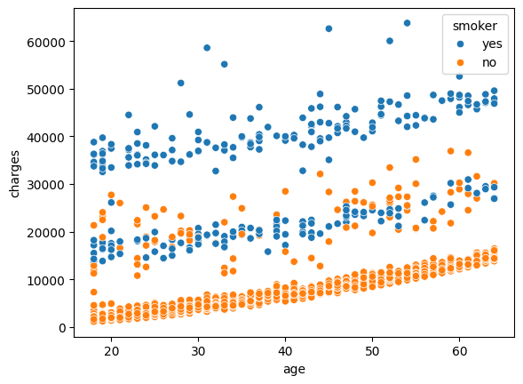
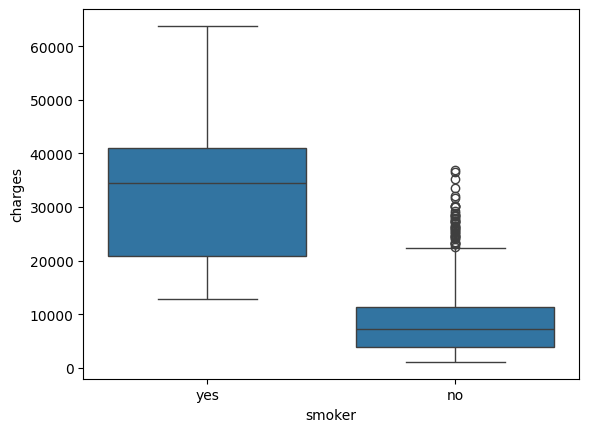
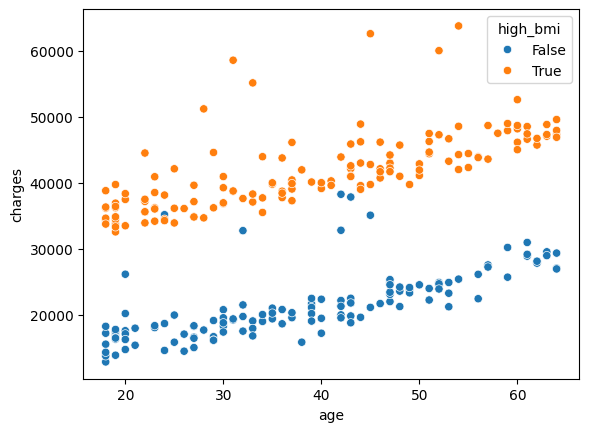

# Medical Insurance Cost
Medical cost insurance data analysis.
This is one of my first projects to practice exploratory data analysis with Python. EDA was used to find correlations in the dataset and predict charges based on given features. 

This is a project to discover the correlation of charges for medical insurance based on the features Age, BMI, Smoker, Sex, Children and Region.

The dataset can be found here: https://www.kaggle.com/datasets/mirichoi0218/insurance

### Description of dataset
The dataset consists of 1338 entries with columns age, sex, bmi, children, smoker, region, and charges. The age is nearly uniformly distributed ranging from 14 to 64 years. 
The distribution of charges for medical insurance follows an exponential distribution. 

### Results
Based on the data analysis performed with pandas in python, following correlations were found in the dataset:
- The charges increase with the age

- Smokers pay higher charges than non-smokers

- Among the smokers, persons with a BMI above 30 pay significant higher charges than persons below a BMI of 30 
 

### Conclusion
To predict the charges, one can fit a linear or exponential regression over the age for the 4 groups smoker with BMI >30, and BMI <30, and for non-smokers with BMI >30 and BMI <30. 
The trend shows that smoker pay more charges compared to non-smokers and persons with BMI >30 are charged more compared to persons with lower BMI.

## Python environment
Python version: 3.11.2

pyenv local 3.11.2  
python -m venv .venv  
source .venv/bin/activate  
pip install -r requirements.txt
